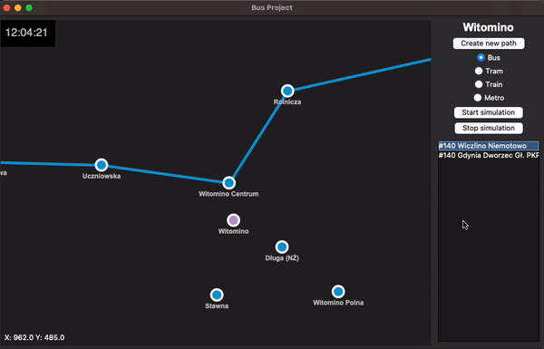

# Welcome to bus project! 🚌

The Bus Project is an application designed to simulate public transport around the city. It allows you to create new stations and cities and connect them using various modes of public transportation.

_Explore the functionalities of the Bus Project and enjoy simulating public transportation in your city!_

---

# Simulate your city

The simulation offers the flexibility to set the time of day or adjust the simulation speed. Animation will show vehicles moving in real-time!

### Multiple tranport types to choose

1. 🚌 Bus
2. 🚊 Tram
3. 🚆 Train
4. 🚇 Metro

---

## User-Friendly GUI

The user interface is incredibly user-friendly. With just a simple right-click on the map, you gain the ability to effortlessly incorporate new stations and transport paths into your public transport system.

---

## OpenStreetMaps city importing

With the Bus Project, you can easily import cities from OpenStreetMaps and visualize the public transport routes within your chosen city.

